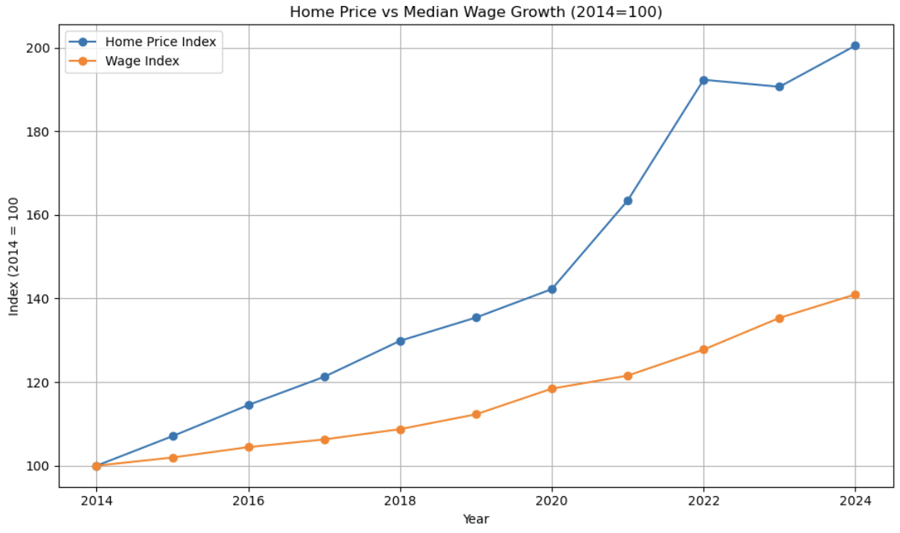
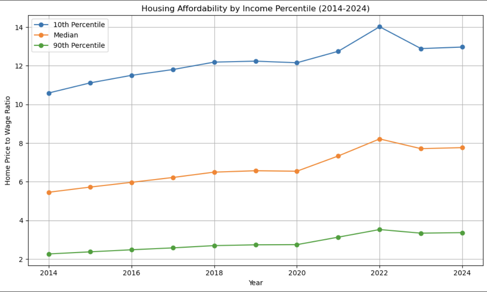
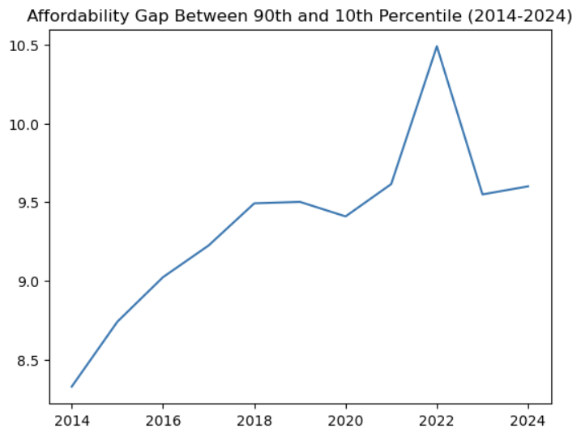
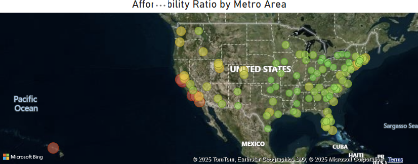

# U.S. Housing Affordability: A Decade of Decline
An Analysis of U.S. housing affordability trends from 2014-2024 using BLS wage data and Zillow home prices

## Topic Overview
Inflation has risen to the forefront of the American psyche in recent years. Presidential candidates have made it a cornerstone of their campaigns, technocrats are scrambling to lower inflation rates to their mandated levels, and the youth are reportedly stocking up on avocado toast and starbucks "because they'll never be able to afford to buy a house anyway." To their credit, housing has been one of the top goods mentioned in the inflation debate, with many Americans complaining about skyrocketing home and rent prices. But is this true? Are home prices really becoming more unaffordable? Or is this just a case of sticker shock, with wages rising in lockstep with inflation?

## Data Sources
This analysis combines income data from the Bureau of Labor Statistics (BLS) with housing price data from Zillow to examine the relationship between wages and housing prices in the top 100 U.S. metro areas. The specific datasets used are as listed:

1. [BLS Occupational Employment and Wage Statistics](https://www.bls.gov/oes/tables.htm)
Source: "Occupational Employment and Wage Statistics (OEWS)" tables from May 2014 to May 2024
Variables Used in Analysis: Median annual income, 10th, 25th, 75th, and 90th income percentiles, Metropolitan area, Year

2. [Zillow Home Value Index (ZHVI)](https://www.zillow.com/research/data/)
Source: "Zillow Home Value Index for all homes, by metropolitan area"
Variables Used in Analysis: Average home price, Size rank, Dates, Metropolitan area

## Data Preparation and Cleaning
The raw datasets from the Bureau of Labor Statistics and Zillow required a fair amount of preparation and cleaning before being able to merge them neatly into one file for proper analysis. The steps taken to prepare the final dataset include:

1. BLS Occupational Employment and Wage Statistics
- As the BLS data was contained in seperate tables for each year, to create a singular dataset containing data from 2014-2024 these tables had to be concatenated. However, column headers used by the BLS were incosistent for this time period, preventing concatenation. All column names were standardized and then the tables were concatenated to form the complete 2014-2024 dataset.
- The dataset was then filtered to show only the data from 'All Occupations' to get the overall picture of wages.
- Metro area names and codes showed significant variation through the years as metropolitan area delimitations were redefined. Additionally, the metro area names followed a 'City-City-City, State' format, New York-Neward-Jersey City, NY-NJ-PA for example. On the other hand, the Zillow dataset simply listed the principal city of each metro. Due to the inconsistencies throughout the years in the BLS dataset, all metros were converted to the Zillow format by separating the cities on the '-' and dropping the state using regex.
- The now seperated city names were then exploded to their own rows to allow for merging with the Zillow table.

2. Zillow Home Value Index (ZHVI)
- Used regex to drop the state abbreviation from the metro name.
- The Zillow data was in a wide format. Each month from 2000 to 2025 had its own column. In order to merge it with the BLS data, which was in a long format, the Zillow data was melted to long format as well, with each month getting a row.
- The dataset was filtered to only show the data from May of each year from 2014 to 2024. This matched better with the BLS dataset, which publishes data every year in May.

3. Merging and Metrics Created
- Once both datsets were cleaned, they were merged on year and metro area name.
- Affordability ratios were created for the median income, the 10th percentile, the 90th percentile, and the 25th percentile. This affordability is defined as Home Price / Income, or how many year it takes for someone to be able to earn enough money to buy the average house in their metropolitan area.
- Home prices and wages were indexed to better visualize their relative growth.
- Affordability gaps were calculated to viusalize inequality in affordability between the various income groups, 90th percentile - 25th percentile for example.

## Key Insights
After cleaning and preparing the data, the merged dataset was analyzed to find trends in housing affordability over time. Not only were overall affordabilty trends examined, but also which income groups and metro areas have been most affected.

1. Housing VS Wages
- Nationally, housing prices have have risen 100% from 2014 to 2024, while wages have only grown 40% during the same time period.
- This divergence widened most sharply following 2020, coinciding with the pandemic and subsequent economic recovery period.
- The home price to salary ratio increased from 5.58 to 7.94, meaning the median worker would need roughly 2.4 more years of income to be able to buy a house outright.

2. Income Inequality in Housing
- The affordability ratio for all income levels show an increase from 2014 to 2024, showing peaks in 2022. In other words, the price of housing is outpacing wage growth for all income levels.
- However, the affordability ratio is not growing evenly for all income levels. The affordaibilty gap between the top 10% of earners and the bottom 25% of earners has increased from 6.29 years in 2014 to 7.44 years in 2024, which is down from a peak of 8.09 years in 2022.
- In 2024 it takes 13.27 years of wages for the bottom 10% of earners to be able to buy a home outright, while it takes 3.46 years of wages for someone in the top 10% to do the same.

3. Geographic Trends
- The top 3 most affordable metros in 2024 are Toledo, Ohio, Jackson Mississippi, and Wichita, Kansas, all with affordability ratios of 4.53 or below.
- The top 3 most unaffordable metros in 2024 are San Jose, California, Oxnard, California, and Los Angeles, California, with affordability ratios ranging from 17.42 in LA to 18.37 in Oxnard.
- The nation's most populous state, California, is also the most unaffordable, with 7 Californian metros being in the top 10 most unaffordable.
- The west in general has higher home price-to-income ratios compared to the rest of the country. Other relatively unaffordable areas are coastal northeastern metros and Florida. On the other side of the spectrum, midwestern, southern and non-coastal northeastern cities tend to have home price-to income ratios below the national average.

